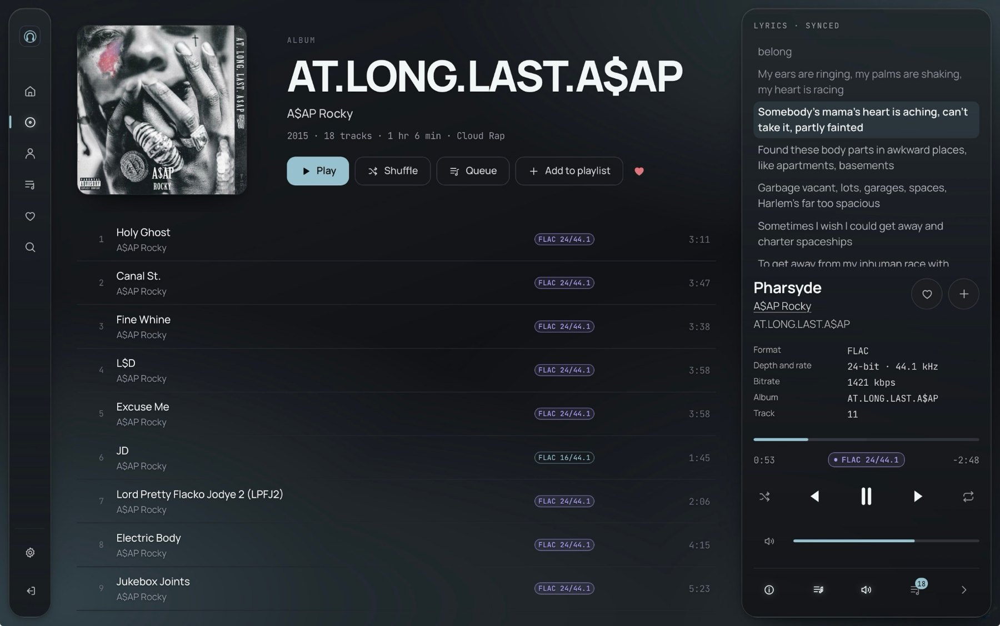
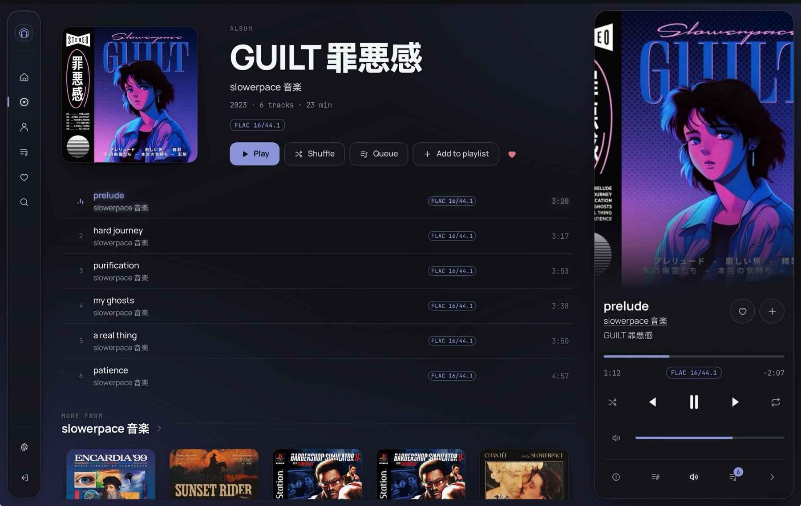

<div align="center">


# Heddohon

**Server-rendered music player for Navidrome/Subsonic and Jellyfin libraries.**

Audio and artwork are proxied by the server, so the music server does not need
to be reachable from the browser.

</div>


## How it works

Feishin and Aonsoku connect to the music server from the browser. That has two
consequences: the music server must be reachable from every device you use, and
the upstream credential is present in the client.

Heddohon connects from the server instead. The browser then makes requests to
Heddohon only.

```
 browser ──► Heddohon ──► Navidrome / Jellyfin
             │
             └── the only host you expose publicly
```

Sign-in is a live call to the music server; Heddohon has no user table of its
own. [SECURITY.md](SECURITY.md) documents this in
full, along with the known gaps.

## Features

- **Original files by default.** Subsonic requests use `format=raw`, Jellyfin
  requests use `static=true`, so the file arrives as it sits on disk. Nothing in
  the chain resamples, at any setting. The player displays what is being
  decoded: `FLAC 24/96`, `FLAC 24/192`, `MP3 320`.
- **Transcoding when you want it.** For a connection that will not carry a
  24/192 master, the music server can be asked to convert instead: MP3, Opus or
  AAC, at a bitrate you choose. Pressing the quality badge in the player turns
  it on and off without interrupting the track, and the badge then names what is
  actually arriving rather than what the file is.
- **Server-side rendering.** Pages arrive built, including the theme and the
  interface scale, so there is no flash of the wrong one and no empty layout
  waiting on JavaScript.
- **Per-account state.** Settings and the play queue are stored on the server
  against your account, so another device resumes where you left off.
- **Cover art is cached on the server.** Artwork is kept after the first fetch
  and served from disk, so a second device does not ask the music server to
  render it again. The size is a setting and Settings has a button that empties
  it.
- **Recommendations.** Albums and artists carry a "You might like" shelf, taken
  from the music server. Jellyfin computes it from its own metadata; Navidrome
  needs `ND_LASTFM_APIKEY` set, and the shelf is absent without it. See
  [Configuration](docs/configuration.md).
- **Synced lyrics.** Taken from the music server, timed against the playhead.
- **A tight track handoff.** The next track is buffered into a second audio
  element while the current one plays, so the join does not wait on the network.
  It is not true gapless: no browser decodes across a track boundary
  sample-accurately, and [Audio](docs/audio.md) is specific about what that
  costs and where it shows.
- **One colour, from the record.** Every accent in the interface is sampled from
  the cover that is playing, so the room takes the colour of what you are
  listening to.

Lyrics take the artwork's place in the panel rather than floating over the
controls of the track they belong to. Clicking a timed line seeks to it.



An album page carries the rest of the artist's catalogue under its track list,
and a second shelf of what the music server considers similar.



## Quick start

```bash
git clone https://github.com/zorcerer/heddohon.git && cd heddohon
cp .env.example .env

# Generate a secret. Changing it later signs everyone out.
echo "HEDDOHON_SECRET=$(openssl rand -base64 48)" >> .env

# The music server address, resolved by the container rather than the browser.
echo "HEDDOHON_SUBSONIC_URL=http://10.0.0.10:4533" >> .env

docker compose up -d
```

Open `http://localhost:13000` and sign in with your music server account.

To expose it publicly, set `ORIGIN` to your public `https://` URL and read
[SECURITY.md](SECURITY.md).

## Requirements

Docker, and a reachable Navidrome, another Subsonic-compatible server, or
Jellyfin. To run it without Docker: Node 22 or later, then `npm ci && npm run
build && node build/index.js`.

On Unraid, a Community Applications template is in this repository at
`templates/heddohon.xml`. See
[Configuration](docs/configuration.md#unraid) for the two things worth setting
before the first start.

## Documentation

| | |
| --- | --- |
| [Configuration](docs/configuration.md) | Environment variables, reverse proxy, deployment |
| [Security](SECURITY.md) | Threat model, controls, known gaps, reporting a vulnerability |
| [Design notes](docs/design.md) | How the interface is built and why |
| [Architecture](docs/architecture.md) | Project layout and playlist editing |
| [Audio](docs/audio.md) | What "high-resolution" means in a browser |

## AI disclosure

Heddohon was written with assistance from Claude.
I have reviewed the code, and the security posture has been reviewed
both by me and by several AI-assisted audits. The findings from those
audits, and the fixes, are recorded in [SECURITY.md](SECURITY.md).

It has not been audited by a professional third party. If you intend to expose
it publicly, read the known gaps in [SECURITY.md](SECURITY.md) and form your own
view.

## Licence

MIT.
