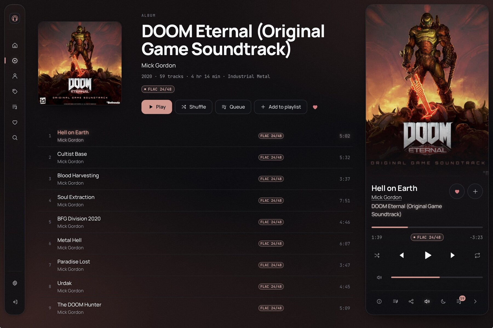

<div align="center">


# Heddohon

**Server-rendered music player for Navidrome/Subsonic and Jellyfin.**

[](https://github.com/zorcerer/heddohon/releases)
[](https://github.com/zorcerer/heddohon/actions/workflows/release.yml)
[](https://hub.docker.com/r/zorcererd/heddohon)
[](https://hub.docker.com/r/zorcererd/heddohon)
[](LICENSE)
<br>


</div>



Unlike Feishin or Aonsoku, Heddohon talks to your music server from the server,
not the browser. Audio and artwork are proxied, so only Heddohon needs to be
exposed and upstream credentials never reach the client.

```
 browser ──► Heddohon ──► Navidrome / Jellyfin
```

## Features

- **Original files by default** — no resampling; the player shows what's decoded (`FLAC 24/192`, `MP3 320`).
- **Optional transcoding** — MP3, Opus or AAC at a chosen bitrate, toggled mid-track from the quality badge.
- **Server-side rendering** — theme and scale arrive built, no flash or empty layout.
- **Per-account state** — settings and queue sync across devices.
- **Cached cover art**, **synced lyrics**, and **recommendations** from your music server.
- **Tight track handoff** — the next track is pre-buffered (not true gapless, see [Audio](docs/audio.md)).
- **Accent colour** sampled from the current album cover.

## Quick start

```bash
git clone https://github.com/zorcerer/heddohon.git && cd heddohon
cp .env.example .env
echo "HEDDOHON_SECRET=$(openssl rand -base64 48)" >> .env
echo "HEDDOHON_SUBSONIC_URL=http://10.0.0.10:4533" >> .env
docker compose up -d
```

Open `http://localhost:13000` and sign in with your music server account.
Exposing it publicly? Set `ORIGIN` and read [SECURITY.md](SECURITY.md).

Images: `ghcr.io/zorcerer/heddohon` or `zorcererd/heddohon`. An Unraid template
is in [`templates/heddohon.xml`](templates/heddohon.xml). Without Docker (Node 22+):
`npm ci && npm run build && node build/index.js`.

## Documentation

- [Configuration](docs/configuration.md) — environment variables, reverse proxy, Unraid
- [Security](SECURITY.md) — threat model, known gaps, reporting
- [Audio](docs/audio.md) — what "high-resolution" means in a browser
- [Architecture](docs/architecture.md) · [Design notes](docs/design.md)

## AI disclosure

Written with assistance from Claude. The code and security posture have been
reviewed by me and by AI-assisted audits (see [SECURITY.md](SECURITY.md)), but
not by a professional third party.

## License

[MIT](LICENSE)
