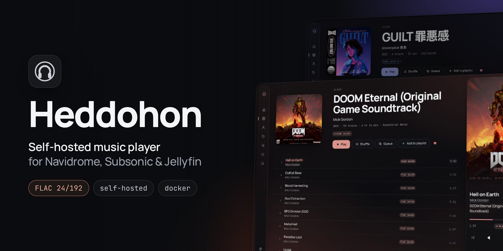
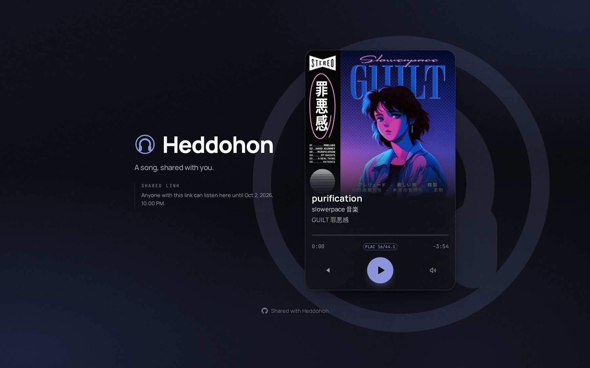

<p align="center">
  
</p>

<p align="center">
  <a href="https://github.com/zorcerer/heddohon/releases"></a>
  <a href="https://github.com/zorcerer/heddohon/actions/workflows/release.yml"></a>
  <a href="https://hub.docker.com/r/zorcererd/heddohon"></a>
  <a href="https://hub.docker.com/r/zorcererd/heddohon"></a>
  <a href="LICENSE"></a>
</p>

Heddohon is a web music player you host yourself. It signs in to your music
server from its own backend and proxies the audio and artwork, so the browser
only ever talks to Heddohon and your upstream credentials stay on the server.

```
 browser ──► Heddohon ──► Navidrome / Jellyfin
```


## Features

- **Original files**, up to FLAC 24/192, with the decoded format shown in the player. Optional transcoding to MP3, Opus or AAC, switched from the quality badge.
- **Coloured by the artwork:** the interface takes its accent from the playing cover, in two themes, Liquid (dark) and Sleek (light).
- **Library:** albums, artists, genres, playlists and favourites, with synced lyrics and recommendations from your music server.
- **Song links** anyone can play without an account, for 1, 7 or 30 days.
- **Follows you around:** the queue and settings sync across devices, and it installs as an app on phones and desktops.
- **Scrobbling** to Last.fm and ListenBrainz through Navidrome, ReplayGain volume normalisation, and a sleep timer.
- **SQLite or PostgreSQL**, with a one-time import from SQLite.

<table>
  <tr>
    <td width="50%"></td>
    <td width="50%"></td>
  </tr>
  <tr>
    <td align="center">Synced lyrics</td>
    <td align="center">More from the artist</td>
  </tr>
  <tr>
    <td colspan="2"></td>
  </tr>
  <tr>
    <td colspan="2" align="center">A shared song, for anyone with the link</td>
  </tr>
</table>

## Quick start

```bash
git clone https://github.com/zorcerer/heddohon.git && cd heddohon
cp .env.example .env
echo "HEDDOHON_SECRET=$(openssl rand -base64 48)" >> .env
echo "HEDDOHON_SUBSONIC_URL=http://10.0.0.10:4533" >> .env
docker compose up -d
```

Open `http://localhost:3000` and sign in with your music server account. To
expose it publicly, set `ORIGIN` and read [SECURITY.md](SECURITY.md).

Images are `ghcr.io/zorcerer/heddohon` and `zorcererd/heddohon`, and an Unraid
template is in [`templates/heddohon.xml`](templates/heddohon.xml). Without
Docker, on Node 22 or later: `npm ci && npm run build && node build/index.js`.

## Documentation

| | |
| --- | --- |
| [Configuration](docs/configuration.md) | Environment variables, reverse proxies, PostgreSQL, Unraid |
| [Security](SECURITY.md) | Threat model, known gaps, reporting a vulnerability |
| [Audio](docs/audio.md) | Formats, transcoding, and what high resolution means in a browser |
| [Architecture](docs/architecture.md) | How the server, the client and the music server fit together |
| [Design notes](docs/design.md) | Why the interface looks and behaves as it does |
| [Contributing](CONTRIBUTING.md) | Reporting bugs, suggesting features, and sending pull requests |

## AI disclosure

Written with agentic assistance from Claude. The code and security posture have been
reviewed by me and by multiple AI-assisted audits, documented in [SECURITY.md](SECURITY.md)

## License

[MIT](LICENSE)

<p align="center">
  <a href="https://ko-fi.com/zorcerer"></a>
</p>
