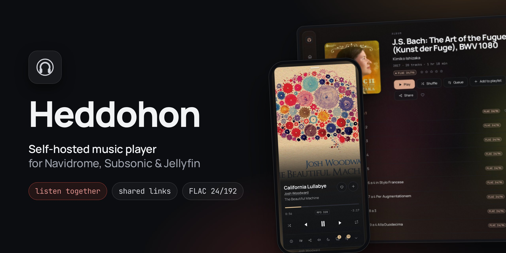
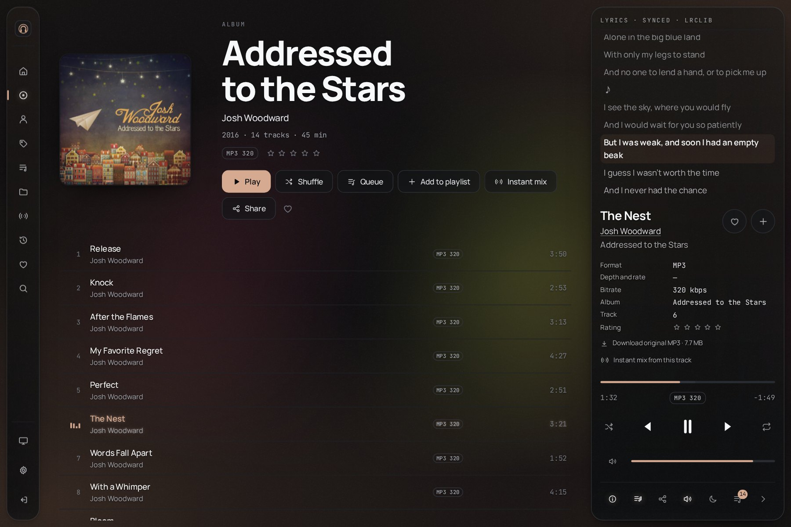
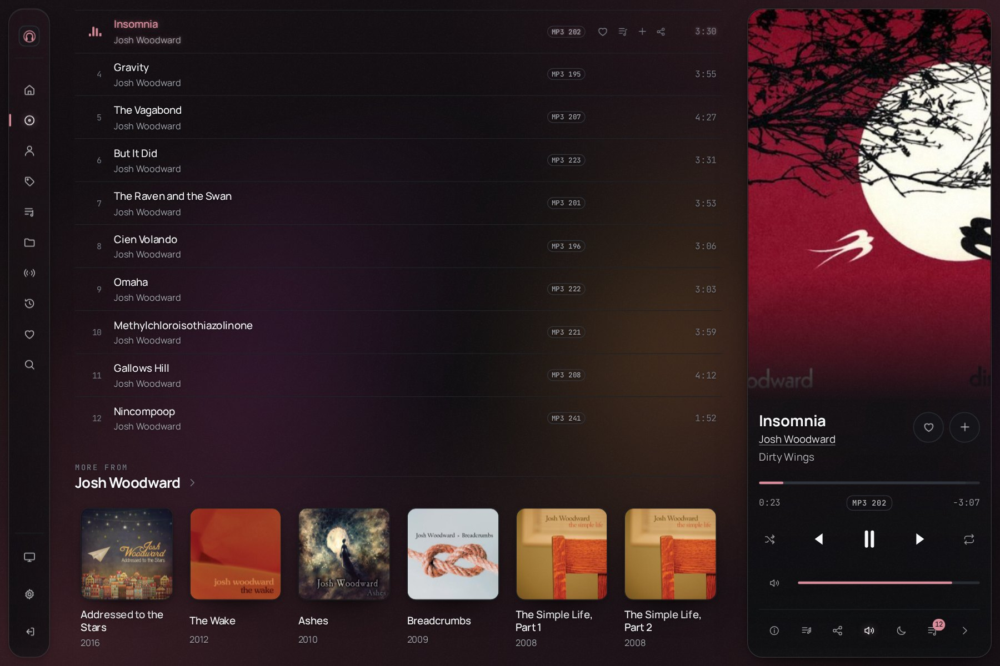
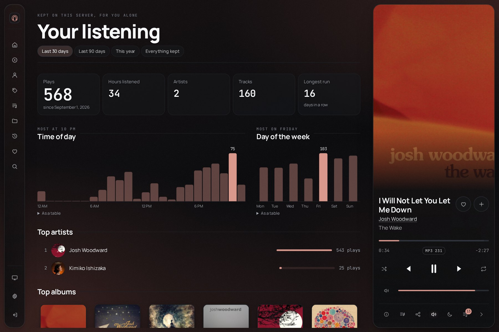
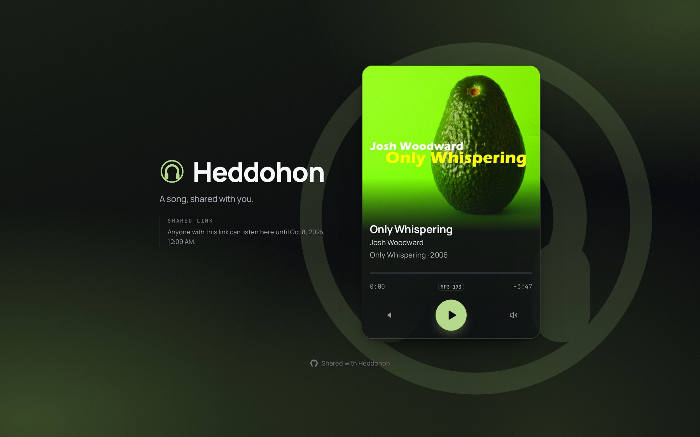
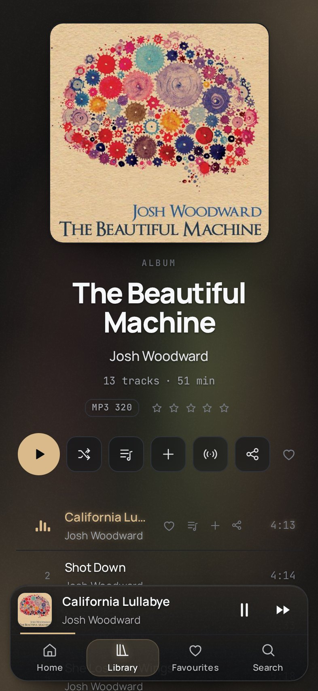
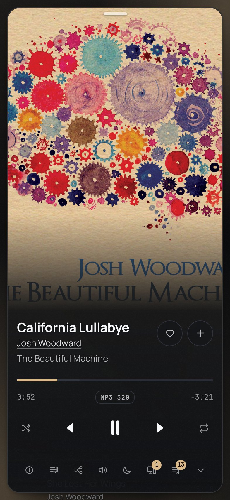

<p align="center">
  
</p>

<p align="center">
  <a href="https://github.com/zorcerer/heddohon/releases"></a>
  <a href="https://github.com/zorcerer/heddohon/actions/workflows/release.yml"></a>
  <a href="https://hub.docker.com/r/zorcererd/heddohon"></a>
  <a href="https://hub.docker.com/r/zorcererd/heddohon"></a>
  <a href="LICENSE"></a>
</p>

Heddohon is a web music player you host yourself. It signs in to your music
server from its own backend and proxies the audio and artwork, so the browser
only ever talks to Heddohon and your upstream credentials stay on the server.

```
 browser ──► Heddohon ──► Navidrome / Jellyfin
```

The website, with screenshots and the install steps, is
[heddohon.app](https://heddohon.app).

## Features

- **Original files**, up to FLAC 24/192, with the decoded format shown in the player. Optional transcoding to MP3, Opus or AAC, switched from the quality badge. Casts to a Chromecast from Chrome on Android and to AirPlay from Safari.
- **Coloured by the artwork:** the interface takes its accent from the playing cover, in two themes, Liquid (dark glass) and Paper (parchment and ink).
- **Library:** albums, artists (their releases listed as albums, EPs, singles, live records and compilations, with the albums of others they appear on), genres, playlists, favourites and the folders on disk, with synced lyrics and recommendations from your music server. Playlists reorder by dragging or with the arrow keys. Songs and albums take a rating of one to five stars on Navidrome.
- **Instant mix** from a track, an album or an artist: up to 100 similar tracks from your music server, with AudioMuse-AI's sonic similarity where it is installed.
- **Internet radio** from the stations Navidrome lists, played through your server, from a stream address or an .m3u or .pls playlist.
- **Links to songs, albums and playlists** anyone can play without an account, for 1, 7 or 30 days. Or listen together: a live link that plays what you play, as you play it, with reactions.
- **On a phone,** the navigation and the player share one panel at the foot of the screen, and the full player pulls down to close. A living-room screen shows what plays full screen, with the synced lyrics, for a TV across the room.
- **Follows you around:** the queue and settings sync across devices, and it installs as an app on phones and desktops. One browser can pause, skip or seek another signed in to the same account, and move the queue between them. Settings lists each browser signed in to your account and signs out any of them. There is also a desktop app for Linux (an AppImage) and for Windows (an installer and a portable .exe, unsigned) on each release, which opens your server in a window of its own, and for Android an experimental APK that does the same through the phone's browser.
- **Crossfade and an equaliser,** both off until switched on. The crossfade gives two tracks that follow each other on an album the tight handoff instead. The 10-band equaliser is kept per browser, for the headphones or speakers it plays through, and takes a headphone correction from an AutoEq ParametricEQ.txt, or from a search of the AutoEq database where the server allows it.
- **Scrobbling** to Last.fm and ListenBrainz through Navidrome, ReplayGain volume normalisation, and a sleep timer. Recently played lists every track played, kept for good unless you choose 90 days or a year, can start from the last play of each track as Jellyfin or Navidrome kept it, and Your listening sums it up: top artists, albums and tracks, hours, the time of day and the longest run of days, kept on your own server. From the same history, the home page shows the albums played on this date in earlier years, and the ones played often and not in the last six months.
- **SQLite or PostgreSQL**, with a one-time import from SQLite.

<table>
  <tr>
    <td width="50%"></td>
    <td width="50%"></td>
  </tr>
  <tr>
    <td align="center">Synced lyrics</td>
    <td align="center">More from the artist</td>
  </tr>
  <tr>
    <td colspan="2"></td>
  </tr>
  <tr>
    <td colspan="2" align="center">Your listening: the history summed up, by 30 days, 90 days, the year or everything kept</td>
  </tr>
  <tr>
    <td colspan="2"></td>
  </tr>
  <tr>
    <td colspan="2" align="center">A shared song, for anyone with the link</td>
  </tr>
  <tr>
    <td colspan="2" align="center">
      
      &nbsp;
      
    </td>
  </tr>
  <tr>
    <td colspan="2" align="center">On a phone: the player and the tabs in one panel, and the full player pulled up from it</td>
  </tr>
</table>

<sub>Music in the screenshots: songs and cover art by Josh Woodward
([joshwoodward.com](https://www.joshwoodward.com/)), including "The Nest",
"Insomnia", "I Will Not Let You Let Me Down", "Only Whispering" and
"California Lullabye", under
[CC BY 4.0](https://creativecommons.org/licenses/by/4.0/); J.S. Bach, The Art of
the Fugue, played by Kimiko Ishizaka, dedicated to the public domain
([CC0](https://creativecommons.org/publicdomain/zero/1.0/)). The plays that
Your listening counts are generated for the screenshot.</sub>

## Quick start

```bash
git clone https://github.com/zorcerer/heddohon.git && cd heddohon
cp .env.example .env
echo "HEDDOHON_SECRET=$(openssl rand -base64 48)" >> .env
echo "HEDDOHON_SUBSONIC_URL=http://10.0.0.10:4533" >> .env
docker compose up -d
```

Open `http://localhost:3000` and sign in with your music server account. To
expose it publicly, set `ORIGIN` and read [SECURITY.md](SECURITY.md).

Images are `ghcr.io/zorcerer/heddohon` and `zorcererd/heddohon`, for
`linux/amd64` and `linux/arm64` (a Raspberry Pi 4 or 5 on a 64-bit OS, an ARM
NAS, an Ampere server); 32-bit ARM is not built. Without Docker, on Node 22
or later: `npm ci && npm run build && node build/index.js`.

On Unraid, Heddohon is listed in Community Applications, from the template in
[`templates/heddohon.xml`](templates/heddohon.xml):

<a href="https://ca.unraid.net/apps/heddohon-0bp7lm80vkr69w"></a>

`latest` is the newest release. `dev` is built once a day from the `dev`
branch, when it has changed and passed the test suites, ahead of the next
release, for trying what is coming; it can break, and a database it has
migrated may not open in the release before it.

The Android app is an APK on each release. [Obtainium](https://obtainium.imranr.dev)
installs it from there and updates it from each later release. On a phone with
Obtainium installed, this adds Heddohon to it:

<a href="https://apps.obtainium.imranr.dev/redirect?r=obtainium://add/https://github.com/zorcerer/heddohon"></a>

## Documentation

| | |
| --- | --- |
| [Configuration](https://github.com/zorcerer/heddohon/wiki/Configuration) | Environment variables, reverse proxies, PostgreSQL, Unraid |
| [Apps](https://github.com/zorcerer/heddohon/wiki/Apps) | The desktop app for Linux and Windows, the Android app, and running them behind a sign-in |
| [Security](SECURITY.md) | Threat model, known gaps, reporting a vulnerability |
| [Audio](https://github.com/zorcerer/heddohon/wiki/Audio) | Formats, transcoding, and what high resolution means in a browser |
| [Architecture](https://github.com/zorcerer/heddohon/wiki/Architecture) | How the server, the client and the music server fit together |
| [Design notes](https://github.com/zorcerer/heddohon/wiki/Design-notes) | Why the interface looks and behaves as it does |
| [Contributing](CONTRIBUTING.md) | Reporting bugs, suggesting features, and sending pull requests |

## AI disclosure

Written with agentic assistance from Claude. The code and security posture have been
reviewed by me and by multiple AI-assisted audits, documented in [SECURITY.md](SECURITY.md)

## License

[MIT](LICENSE)

<p align="center">
  <a href="https://ko-fi.com/zorcerer"></a>
</p>
